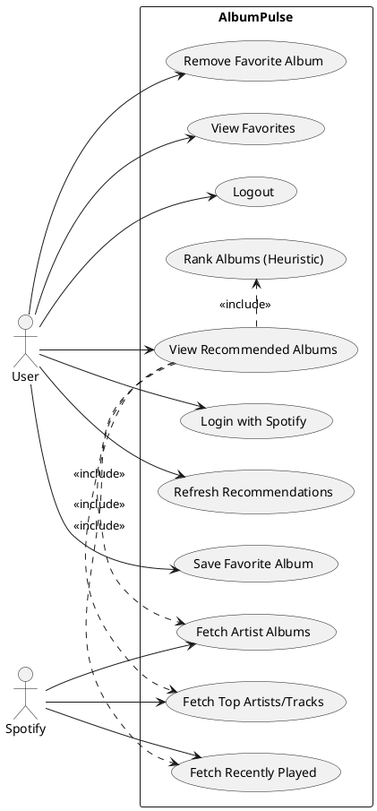

# 08 — UML Use Case (PlantUML)

Copy đoạn PlantUML này vào tool (PlantUML / eraser text-to-diagram / any renderer):

```plantuml
@startuml
left to right direction
skinparam packageStyle rectangle

actor "User" as U
actor "Spotify" as S

rectangle "AlbumPulse" {
  usecase "Login with Spotify" as UC1
  usecase "View Recommended Albums" as UC2
  usecase "Refresh Recommendations" as UC3
  usecase "Save Favorite Album" as UC4
  usecase "Remove Favorite Album" as UC5
  usecase "View Favorites" as UC6
  usecase "Logout" as UC7

  usecase "Fetch Top Artists/Tracks" as UC8
  usecase "Fetch Recently Played" as UC9
  usecase "Fetch Artist Albums" as UC10
  usecase "Rank Albums (Heuristic)" as UC11
}

U --> UC1
U --> UC2
U --> UC3
U --> UC4
U --> UC5
U --> UC6
U --> UC7

UC2 .> UC8 : <<include>>
UC2 .> UC9 : <<include>>
UC2 .> UC10 : <<include>>
UC2 .> UC11 : <<include>>

S --> UC8
S --> UC9
S --> UC10
@enduml
```
